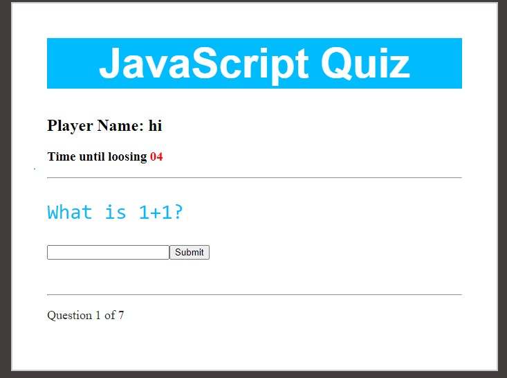

Documentation

1.	Add a representative image for the assignment and start with a short description of your solution.
The application uses RESTful API to manage the data. As well as asynchronous programming to refresh timer and to connect with the server. After fetching the questions from the server, the application will display the question and the choices / input field. The user will be able to select one of the choices or to write the answer. After the user selects the answer, the application will check the answer by sending it back to the server. If the answer is correct, the application will show the next question. If the answer is incorrect or the timer is 0, the application (browser) will tell the user and refresh the page to play another round. The score and the name of the winners will be stored in localStorage to be presented at the end with the best 5 players.
2.	Explain how a user can download and start your game.
To be able to play the Quiz game, you just must download the whole package and have the snowpack installed, then once you run npm run build, npm start in the console, the game will start running on localhost port 8080 with a question to enter a name.
3. Shortly explain the rules of the game, so the user knows how to play it.
The game starts with a question to enter the name and once it started you have 10 seconds to answer each question. If the user did not respond to the question within this period or answered the question wrongly the game ends and a high score list of players will be displayed.
4. Explain if you are using any linters to validate the code behind the game.
I used linters to analyze the code and show me the programming errors or finding syntax errors and typos. According to the assignment instructions it was suggested to use stylelint, htmllint and eslint for checking the CSS file, HTML file, and the Js file respectively. 

